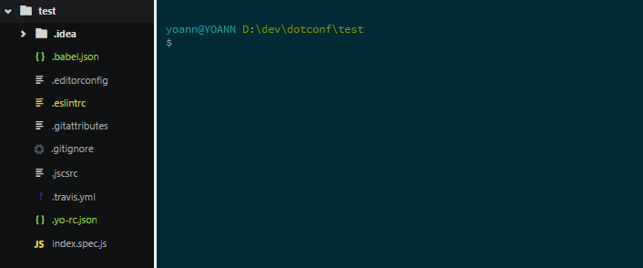

> One config, to rule them all.

`dotconfig` will archive all your `.files/directories` into one `.config`.

It will extract them when needed (advised in `npm postinstall`).



## Usage

````bash
dotconfig [OPTIONS] [ARGS]
```

## Options:
```bash
# Actions
-a,     --archive                   Archive your configs
-e,     --extract                   Extract your configs

# Options

-d,     --destination      [STRING] Destination of the archive
# Default is .config
-p,     --pattern          [STRING] Pattern to get config files
# Default is .*
-s,     --safe             [BOOL]   Execute in safe mode
# Default is true
        --safeDestination  [STRING] Destination of the safe storage
# Default is .tempDotConfig
-i,     --ignore           [ARRAY]  What to ignore
# Default is .git*,node_modules/**,.config,.tempDotConfig/**

# CLI related

-k,     --no-color                  Omit color from output
        --debug                     Show debug information
-v,     --version                   Display the current version
-h,     --help                      Display help and usage details
```

By default, options can be read in the `package.json` under `dotconfig` object.

```json
"dotconfig": {
    "destination": ".config",
    "safeDestination": ".tempDotConfig",
    "safe": true,
    "pattern": ".*",
    "ignore": [
        ".git*",
        "node_modules/**" ,
        ".config",
        ".tempDotConfig/**"
    ]
}
```
